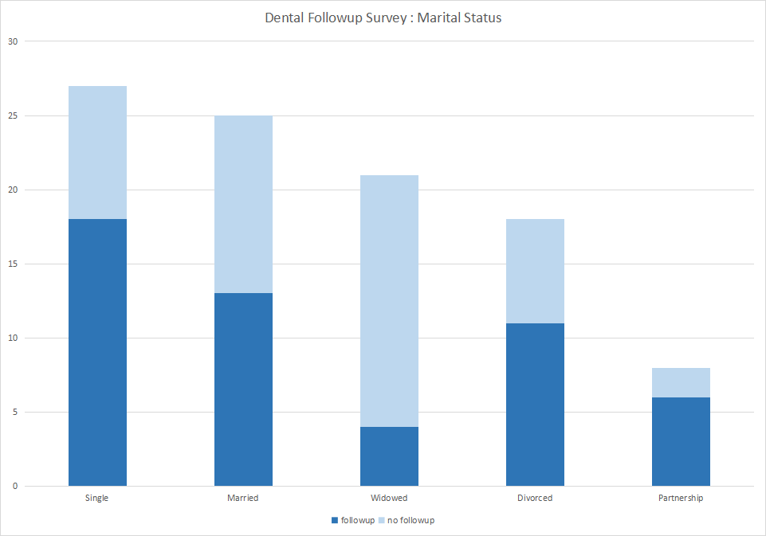

# Dental Followup Data Analysis

## Scenario

You’ve been working for the nonprofit National Dental Society (NDS) as a junior data analyst. The mission of the NDS is to help its members advance the oral health of their patients. Part of this involves automatically scheduling follow-up appointments. NDS believes the follow-up is an important step to ensure patient recovery and minimize infection. Unfortunately, many patients don’t show up for these appointments, so the NDS wants to create a campaign to help its members learn how to encourage their patients to take follow-up appointments seriously. If successful, this will help the NDS achieve its mission of advancing the oral health of all patients. Your supervisor has just sent you an email describing the issue of many missed follow-up appointments. You are tasked with analyzing data about this problem and presenting your findings using data visualizations. 

## Dataset Overview

Analyzing the datasets, more than half the patients come for **Extraction**. Following **Extraction**, we have **Crowning**,  **Implant** and **Emergency Surgery**. The least dental procedure performed is the **Veneers** procedure.

# Visualizations with Spreadsheet

I have visualized the data based on procedure, age_group and marital status.

## Procedure Op Following

> We can see 50% of patients always return for followup session based on procedure operation.

## Age Group Following

> When visualizing based on age group, we can see patients above 60 yrs fail to followup.

## Marital Status Following

> Visualizing based on marital status, widowed patients also fail to followup.

# Conclusion

Based on the analyses, we can conclude patients above 60 yrs and widowed patients fail to attend followup appointments.

